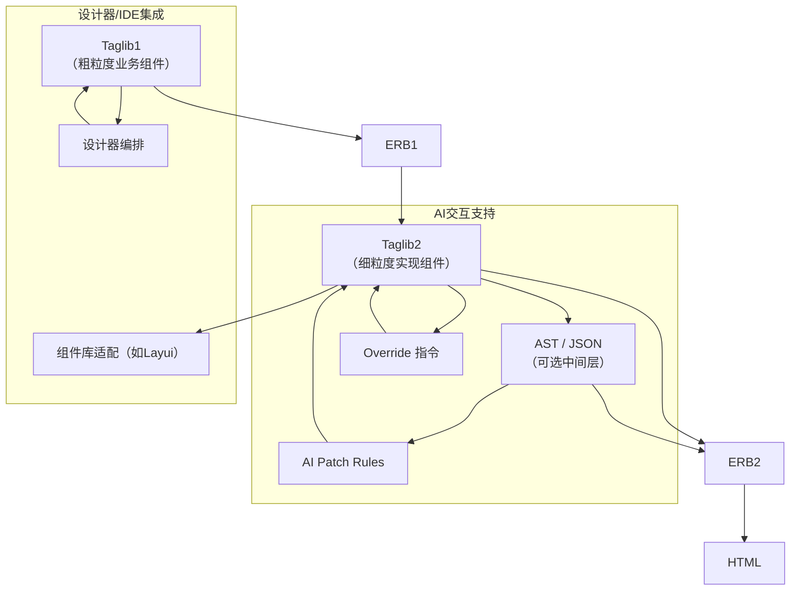
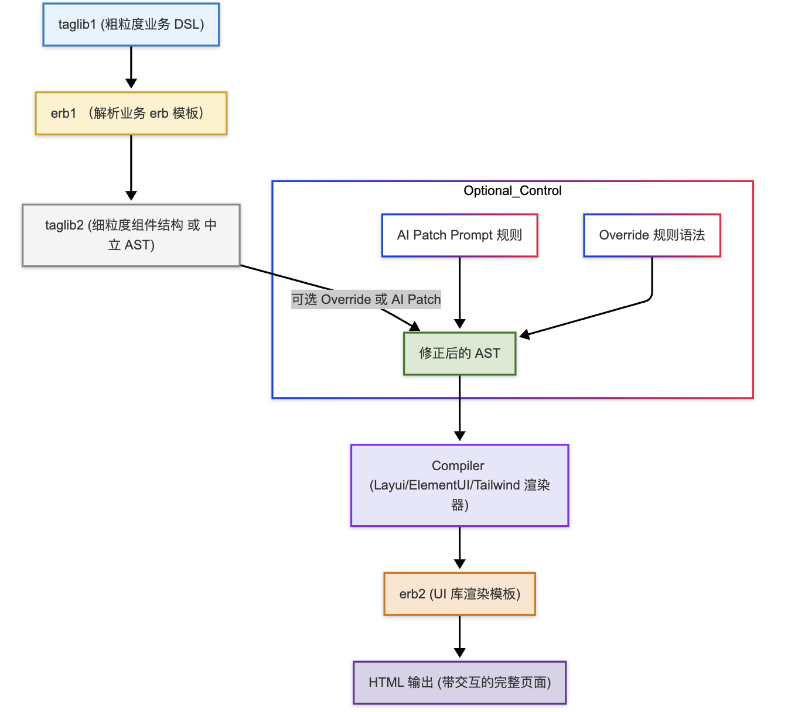

# 渲染流水线结构图（含 AI 与 Override 支持）

## 说明

- **Taglib1**：粗粒度，业务导向，例如 `<kr:user-picker>`。
- **ERB1**：处理业务层模板逻辑，生成中间 taglib2 结构。
- **Taglib2**：细粒度实现组件，如 `<kr-dialog>`，可以由不同技术栈实现（Layui / Tailwind / 自研等）。
- **AST/JSON**：用于 AI Patch、结构优化、重构等用途。
- **ERB2**：最终转为 HTML。
- **AI Patch Rules**：AI 可基于 AST 修改结构或行为。
- **Override 指令**：用于精细化覆盖默认行为，支持 DSL 扩展。